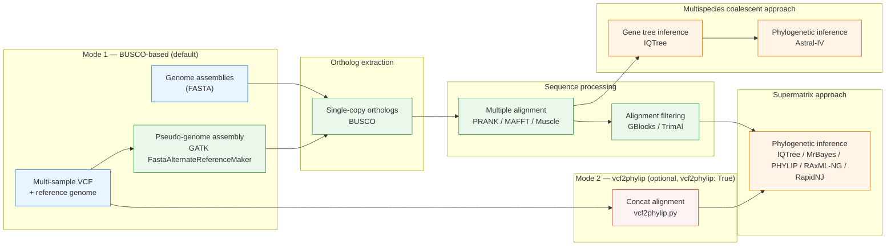

# Snakemake workflow: BuscoClade

[](https://snakemake.github.io)
[](https://opensource.org/licenses/MIT)

## Description

Pipeline to construct species phylogenies from genome assemblies or variant call data (VCF).


```mermaid
flowchart LR

%% ----- MODE 1 INPUT -----
subgraph INPUT["Mode 1 — BUSCO-based (default)"]
A["Genome assemblies<br/>(FASTA)"]
V["Multi-sample VCF<br/>+ reference genome"]
V1["Pseudo-genome assembly<br/>GATK FastaAlternateReferenceMaker"]
end

%% ----- BUSCO -----
subgraph BUSCO["Ortholog extraction"]
B["Single-copy orthologs<br/>BUSCO"]
end

%% ----- PREPROCESSING -----
subgraph PREP["Sequence processing"]
C["Multiple alignment<br/>PRANK / MAFFT / Muscle"]
D["Alignment filtering<br/>GBlocks / TrimAl"]
end

%% ----- TREE APPROACH -----
subgraph TREE["Multispecies coalescent approach"]
E["Gene tree inference<br/>IQTree"]
H["Phylogenetic inference<br/>Astral-IV"]
end

%% ----- CONCAT -----
subgraph CONCAT["Supermatrix approach"]
F["Phylogenetic inference<br/>IQTree / MrBayes / PHYLIP / RAxML-NG / RapidNJ"]
end

%% ----- MODE 2 -----
subgraph VCF2PHYLIP["Mode 2 — vcf2phylip (optional, vcf2phylip: True)"]
V2["Concat alignment<br/>vcf2phylip.py"]
end

%% ----- EDGES: MODE 1 -----
A --> B
V --> V1
V1 --> B
B --> C
C --> D
C --> E
E --> H
D --> F

%% ----- EDGES: MODE 2 -----
V --> V2
V2 --> F

%% ----- STYLE -----
classDef input fill:#e8f4ff,stroke:#2b7cd3,stroke-width:1px
classDef process fill:#eaf7ea,stroke:#2f9e44,stroke-width:1px
classDef phylo fill:#fff4e6,stroke:#e67700,stroke-width:1px
classDef vcf fill:#fef3f3,stroke:#c0392b,stroke-width:1px

class A,V input
class V1,B,C,D process
class E,H,F phylo
class V2 vcf
```

- **Ortholog extraction:** [BUSCO](https://busco.ezlab.org/)
- **VCF-based reconstruction:** [GATK FastaAlternateReferenceMaker](https://gatk.broadinstitute.org/hc/en-us/articles/360037594571-FastaAlternateReferenceMaker), [vcf2phylip](https://github.com/edgardomortiz/vcf2phylip)
- **Alignment:** [PRANK](http://wasabiapp.org/software/prank/), [MAFFT](https://mafft.cbrc.jp/alignment/software/), [MUSCLE](https://doi.org/10.1038/s41467-022-34630-w)
- **Trimming:** [GBlocks](https://academic.oup.com/mbe/article/17/4/540/1127654), [TrimAl](http://trimal.cgenomics.org/)
- **Phylogenetic tree construction:** [IQTree](http://www.iqtree.org/), [MrBayes](https://nbisweden.github.io/MrBayes/), [ASTRAL-IV](https://doi.org/10.1093/molbev/msaf172), [RapidNJ](https://birc.au.dk/software/rapidnj), [PHYLIP](https://phylipweb.github.io/phylip/), [RAxML-NG](https://github.com/amkozlov/raxml-ng)
- **Visualization:** [Etetoolkit](http://etetoolkit.org/), [Matplotlib](https://matplotlib.org/stable/)

---

## Usage

### Step 1. Deploy workflow

Clone the repository or download the [latest release](https://github.com/tomarovsky/BuscoClade/releases):

```bash
git clone https://github.com/tomarovsky/BuscoClade.git
```

### Step 2. Prepare input data

BuscoClade has two running modes:

#### Mode 1: BUSCO-based phylogeny (default)

The main mode. Accepts genome assemblies in FASTA format, optionally supplemented with VCF-reconstructed pseudo-genomes. Both input types can be used simultaneously.

**Option A — FASTA assemblies:** Place genome assemblies into the `genomes/` directory. The file prefix is used as the sample name in the output phylogeny. Supported extensions: `.fasta`, `.fna`, `.fa`, and their gzipped versions (`.fasta.gz`, `.fna.gz`, `.fa.gz`).

**Option B — per-sample VCFs + reference genome:** If you have per-sample VCFs, the pipeline reconstructs pseudo-genome assemblies using GATK `FastaAlternateReferenceMaker`, then feeds them into the standard BUSCO workflow alongside any FASTA assemblies from Option A.

Place per-sample VCF files and the corresponding reference genome together into a subdirectory under `input/vcf_reconstruct/`. Each subdirectory is processed independently, which allows reconstructing pseudo-genomes against different references in a single run:

```
input/
    genomes/
        Species1.fasta
        Species2.fasta.gz
    vcf_reconstruct/
        project_hg38/               # one reference per directory
            reference.fasta
            SampleA.vcf.gz
            SampleB.vcf.gz
        project_mm39/               # another reference
            reference.fasta
            SampleC.vcf.gz
```

The directory name is used only for organization — the VCF file prefix determines the sample name in the output phylogeny. No additional config changes are needed; the pipeline detects subdirectories automatically.

#### Mode 2: vcf2phylip (optional, off by default)

An alternative shortcut that builds a concatenated phylip alignment directly from a multi-sample VCF using `vcf2phylip.py`, bypassing BUSCO and sequence alignment entirely.

To use this mode:

1. Place exactly one multi-sample `.vcf.gz` file into `input/vcf2phylip/`.
2. Enable the mode in the config: `vcf2phylip: True`.

```
input/
    vcf2phylip/
        all_samples.vcf.gz    # exactly one multi-sample VCF
```

The two modes are mutually exclusive: when `vcf2phylip: True` is set, only Mode 2 runs. To use the BUSCO-based pipeline (Mode 1), keep `vcf2phylip: False`.

### Step 3. Configure workflow

Modify `config/default.yaml` (recommended: copy it and pass with `--configfile`). The config has four sections:

#### Pipeline configuration

Enable or disable tools and modes:

```yaml
vcf2phylip: False       # set True to enable Mode 2 (vcf2phylip)
quastcore: True         # assembly statistics

alignment: "prank"      # 'prank', 'mafft', or 'muscle'
filtration: "gblocks"   # 'gblocks' or 'trimal'

iqtree: True
astral: True
rapidnj: True
phylip: True
raxml: True
mrbayes: False          # recommended to run GPU-compiled version separately

draw_phylotrees: True
```

#### Tool parameters

Key parameters to configure before running:

**VCF-based reconstruction (Mode 1B):**
- `gatk_path`: Path to the GATK directory (e.g. `"$TOOLS/gatk-4.6.2.0/"`).

**BUSCO:**
- `busco_dataset_path`: Path to a pre-downloaded OrthoDB dataset (e.g. `"$TOOLS/busco_datasets/mammalia_odb12/"`).
- `busco_options`: Use `"--offline"` to run without internet access.
- `busco_mode`: Typically `"genome"`.
- `busco_blacklist`: Path to a file with BUSCO IDs to exclude (optional).

**Alignment** (parameters passed directly to the chosen tool):
- `prank_params`, `mafft_params`, `muscle_params`

**Filtration:**
- `gblocks_params`, `trimal_params`

**Phylogenetic inference:**
- `iqtree_params`: e.g. `"-keep-ident -m TESTNEW -bb 1000"`. Add `-o 'OUTGROUP'` to set an outgroup.
- `astral_params`: e.g. `"--support 2"`. Add `--root 'OUTGROUP'` to set an outgroup.
- `raxml_params`: e.g. `"--model GTR+G --bs-trees 100"`.
- `rapidnj_params`: e.g. `"-b 1000"`.
- `phylip_dnadist_params`: Use `"D\n"` for Kimura 2-parameter model, or `""` for F84 (default).
- `phylip_neighbor_params`: Use `"N"` for UPGMA, or `""` for NJ (default).
- `mrbayes_params`, `mrbayes_block`: MrBayes configuration block file and extra parameters.

**Visualization:**
- `tree_visualization_params`: Specify outgroup as `"--outgroup OUTGROUP"`.

#### Directory structure

Input and output paths are defined here. The defaults are:

```yaml
# Input
genome_dir:          "input/genomes/"
vcf_reconstruct_dir: "input/vcf_reconstruct/"
vcf2phylip_dir:      "input/vcf2phylip/"

# Output (all under results/)
output_dir:          "results/"
```

It is recommended to leave the directory structure unchanged.

#### Resources

Per-tool Slurm settings: partition (`*_queue`), threads (`*_threads`), memory in MB (`*_mem_mb`), and runtime (`*_time`). Adjust these to match your cluster configuration. Note that BUSCO and PRANK are the most time-consuming steps and may require generous time limits (default: `150h` and `100h` respectively).

### Step 4. Execute workflow

Install Snakemake:

```bash
mamba create -c conda-forge -c bioconda -c nodefaults -n snakemake snakemake snakemake-executor-plugin-cluster-generic
mamba activate snakemake
```

Dry run to preview all steps:

```bash
snakemake --profile profile/slurm/ --configfile config/default.yaml --dry-run
```

Remove `--dry-run` to start the actual run.

---

## Advanced usage

### Starting from completed BUSCO results

Move genome assemblies (or create empty placeholder files) into `genomes/`, then place BUSCO output directories under `results/busco/`. Expected structure for `Ailurus_fulgens.fasta`:

```
results/
    busco/
        Ailurus_fulgens/
            busco_sequences/
                fragmented_busco_sequences/
                multi_copy_busco_sequences/
                single_copy_busco_sequences/
            hmmer_output/
            logs/
            metaeuk_output/
            full_table_Ailurus_fulgens.tsv
            missing_busco_list_Ailurus_fulgens.tsv
            short_summary_Ailurus_fulgens.txt
            short_summary.json
            short_summary.specific.mammalia_odb10.Ailurus_fulgens.json
            short_summary.specific.mammalia_odb10.Ailurus_fulgens.txt
```

---

## Contact

Please email: <andrey.tomarovsky@gmail.com> for questions or feedback.
