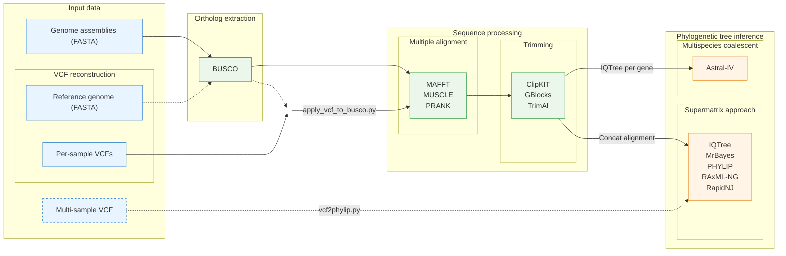

<p align="center">
  <h1 align="center">BuscoClade</h1>
</p>

<p align="center">
  <i>Snakemake-based workflow to construct species phylogenies using BUSCOs</i>
</p>

<p align="center" style="text-decoration: none; border: none;">
	<a href="https://snakemake.github.io" style="text-decoration: none">
		</a>
	<a href="https://opensource.org/licenses/MIT" style="text-decoration: none">
		</a>
	<a href="https://github.com/tomarovsky/BuscoClade/stargazers" style="text-decoration: none">
		</a>
</p>


---

## Workflow


```mermaid
flowchart LR

%% ----- INPUT -----
subgraph INPUT["Input data"]
A_fa["Genome assemblies (FASTA)"]
A_vcf2["Multi-sample VCF"]
subgraph VCF_REF["VCF reconstruction"]
A_ref["Reference genome (FASTA)"]
A_vcf["Per-sample VCFs"]
end
end

%% ----- BUSCO -----
subgraph BUSCO["Ortholog extraction"]
B_busco["BUSCO"]
end

%% ----- PREPROCESSING -----
subgraph PREP["Sequence processing"]
subgraph ALN["Multiple alignment"]
C_aln["MAFFT\nMUSCLE\nPRANK"]
end
subgraph FLT["Trimming"]
C_flt["ClipKIT\nGBlocks\nTrimAl"]
end
end

%% ----- PHYLOGENY -----
subgraph PHYLO["Phylogenetic tree inference"]
subgraph CONCAT["Supermatrix approach"]
E_phy["IQTree\nMrBayes\nPHYLIP\nRAxML-NG\nRapidNJ"]
end
subgraph TREE["Multispecies coalescent"]
D_ast["Astral-IV"]
end
end

%% ----- MERGE NODE (invisible) -----
MERGE(( ))

%% ----- EDGES: MAIN -----
A_fa --> B_busco
A_ref -.-> B_busco
B_busco --> C_aln
B_busco -.-> MERGE
A_vcf --> MERGE
MERGE --> |"apply_vcf_to_busco.py"| C_aln
C_aln --> C_flt
C_flt -->|"Concat alignment"| E_phy
C_flt -->|"IQTree per gene"| D_ast

%% ----- EDGES: VCF2PHYLIP -----
A_vcf2 -. "vcf2phylip.py" .-> E_phy

%% ----- STYLE -----
classDef input fill:#e8f4ff,stroke:#2b7cd3,stroke-width:1px
classDef process fill:#eaf7ea,stroke:#2f9e44,stroke-width:1px
classDef phylo fill:#fff4e6,stroke:#e67700,stroke-width:1px
classDef optional fill:#e8f4ff,stroke:#2b7cd3,stroke-width:1px,stroke-dasharray:4 4
classDef merge fill:none,stroke:none,width:0px

class A_fa,A_ref,A_vcf input
class B_busco,C_aln,C_flt process
class D_ast,E_phy phylo
class A_vcf2 optional
class MERGE merge
```

- **Ortholog extraction:** [BUSCO](https://busco.ezlab.org/)
- **VCF-based SNP application:** [apply_vcf_to_busco.py](#vcf-based-snp-application-apply_vcf_to_buscopy), [vcf2phylip](https://github.com/edgardomortiz/vcf2phylip)
- **Alignment:** [MAFFT](https://mafft.cbrc.jp/alignment/software/), [MUSCLE](https://doi.org/10.1038/s41467-022-34630-w), [PRANK](http://wasabiapp.org/software/prank/)
- **Trimming:** [ClipKIT](https://github.com/JLSteenwyk/ClipKIT), [TrimAl](http://trimal.cgenomics.org/), [GBlocks](https://academic.oup.com/mbe/article/17/4/540/1127654)
- **Phylogenetic tree construction:** [IQTree](http://www.iqtree.org/), [MrBayes](https://nbisweden.github.io/MrBayes/), [ASTRAL-IV](https://doi.org/10.1093/molbev/msaf172), [RapidNJ](https://birc.au.dk/software/rapidnj), [PHYLIP](https://phylipweb.github.io/phylip/), [RAxML-NG](https://github.com/amkozlov/raxml-ng)
- **Visualization:** [Etetoolkit](http://etetoolkit.org/), [Matplotlib](https://matplotlib.org/stable/)

---

## Usage

BuscoClade can be run either directly with Snakemake or via a pre-built
Apptainer container — see [apptainer/README.md](apptainer/README.md)
for instructions.

### Step 1. Deploy workflow

#### Option A: Apptainer container

Pull the latest image and run immediately:

```bash
apptainer pull buscoclade.sif oras://ghcr.io/tomarovsky/buscoclade:latest
```

See [apptainer/README.md](apptainer/README.md) for full usage instructions.

#### Option B: Clone repository

```bash
git clone https://github.com/tomarovsky/BuscoClade.git
```

### Step 2. Prepare input data

#### FASTA assemblies

Place genome assemblies into `input/genomes/`. The file prefix is used as the sample name in the output phylogeny. Supported extensions: `.fasta`, `.fna`, `.fa`, and their gzipped versions (`.fasta.gz`, `.fna.gz`, `.fa.gz`).

#### Per-sample VCFs + reference genome

If you have per-sample VCFs, the pipeline applies SNPs directly to the BUSCO sequences of a reference genome using `apply_vcf_to_busco.py`. Each VCF file must contain exactly one sample. Only SNPs are used — indels present in the VCF are ignored. This avoids rebuilding full pseudo-genome assemblies and re-running BUSCO for each sample — instead, BUSCO is run once on the reference, and ortholog sequences for all other samples are reconstructed by applying their SNPs to the reference BUSCO sequences exon-by-exon.

Place per-sample VCF files and the corresponding reference genome together into a subdirectory under `input/vcf_reconstruct/`. Each subdirectory is processed independently, which allows reconstructing sequences against different references in a single run:

```
input/
    genomes/
        Species1.fasta
        Species2.fasta.gz
    vcf_reconstruct/
        project_hg38/               # one reference per directory
            reference.fasta
            SampleA.vcf.gz
            SampleB.vcf.gz
        project_mm39/               # another reference
            reference.fasta
            SampleC.vcf.gz
```

The directory name is used only for organization — the VCF file prefix determines the sample name in the output phylogeny. No additional config changes are needed; the pipeline detects subdirectories automatically.

BUSCO is run once on the reference genome in each subdirectory. The resulting `single_copy_busco_sequences/` and `metaeuk_output/` are then used by `apply_vcf_to_busco.py` to produce per-sample ortholog sequences.

#### Multi-sample VCF via vcf2phylip (optional)

As an alternative to the BUSCO-based pipeline, a concatenated phylip alignment can be built directly from a multi-sample VCF using `vcf2phylip.py`, bypassing BUSCO and sequence alignment entirely. When `vcf2phylip: True` is set, only this route is executed.

Place exactly one multi-sample `.vcf.gz` file into `input/vcf2phylip/` and enable the option in the config:

```
input/
    vcf2phylip/
        all_samples.vcf.gz    # exactly one multi-sample VCF
```

```yaml
vcf2phylip: True
```

### Step 3. Configure workflow

Modify `config/default.yaml` (recommended: copy it and pass with `--configfile`). The config has four sections:

#### Pipeline configuration

| Option | Default | Choices | Description |
|---|---|---|---|
| `vcf2phylip` | `False` | `True` / `False` | Use multi-sample VCF instead of BUSCO-based pipeline |
| `quastcore` | `True` | `True` / `False` | Compute assembly statistics |
| `alignment` | `"mafft"` | `mafft`, `muscle`, `prank` | Multiple alignment tool |
| `filtration` | `"clipkit"` | `clipkit`, `trimal`, `gblocks` | Alignment trimming tool |
| `iqtree` | `True` | `True` / `False` | Run IQ-TREE |
| `astral` | `True` | `True` / `False` | Run ASTRAL-IV (multispecies coalescent) |
| `rapidnj` | `True` | `True` / `False` | Run RapidNJ |
| `phylip` | `True` | `True` / `False` | Run PHYLIP |
| `raxml` | `True` | `True` / `False` | Run RAxML-NG |
| `mrbayes` | `False` | `True` / `False` | Run MrBayes (recommended to run GPU-compiled version separately) |
| `draw_phylotrees` | `True` | `True` / `False` | Visualize output trees |

#### Tool parameters

**BUSCO**

| Parameter | Default | Description |
|---|---|---|
| `busco_dataset_path` | `"$TOOLS/busco_datasets/mammalia_odb12/"` | Path to pre-downloaded OrthoDB dataset |
| `busco_options` | `"--offline"` | Extra BUSCO flags; use `"--offline"` to run without internet |
| `busco_mode` | `"genome"` | BUSCO mode |
| `busco_blacklist` | `"input/BUSCO.blacklist"` | File with BUSCO IDs to exclude (optional) |
| `busco_histogram_colors` | `"#23b4e8,#008dbf,#fbbc04,#ea4335"` | Bar colors for S, D, F, M in the BUSCO histogram |

**VCF reconstruction**

| Parameter | Default | Description |
|---|---|---|
| `apply_vcf_iupac` | `False` | Encode heterozygous SNPs as IUPAC ambiguity codes (equivalent to GATK `--use-iupac-sample`); if `False`, ALT allele is used for het/hom-alt calls |
| `vcf_reconstruct_ref_as_species` | `False` | Include the reference genome itself as a sample in the output phylogeny |
| `altref_gapaware_insertion` | `False` | Insert AltRef sequences into alignments using gap positions of the corresponding reference instead of re-aligning; recommended when working with many VCF samples using PRANK as aligner; see [Gap-aware AltRef insertion](#gap-aware-altref-insertion) |

**Alignment**

| Parameter | Default | Description |
|---|---|---|
| `mafft_params` | `"--reorder --auto"` | Flags passed to MAFFT |
| `muscle_params` | `""` | Flags passed to MUSCLE |
| `prank_params` | `"-codon"` | Flags passed to PRANK |
| `prank_time` | `"100h"` | PRANK is killed 15 min before this limit; genes that time out are discarded |

**Filtration**

| Parameter | Default | Description |
|---|---|---|
| `clipkit_params` | `"--mode smart-gap"` | Flags passed to ClipKIT; add `--codon` for codon-aware trimming |
| `trimal_params` | `"-automated1"` | Flags passed to TrimAl |
| `gblocks_params` | `"-t=Codons"` | Flags passed to GBlocks |

**Phylogenetic inference**

| Parameter | Default | Description |
|---|---|---|
| `iqtree_params` | `"-keep-ident -m TESTNEW -bb 1000"` | IQ-TREE flags for the concatenated alignment; add `-o 'OUTGROUP'` to set an outgroup |
| `iqtree_per_fna_params` | `"-keep-ident -m TESTNEW -bb 1000"` | IQ-TREE flags for per-gene trees (used as input to ASTRAL) |
| `nodes_filtrataion_by_support` | `70` | Minimum bootstrap support for collapsing nodes before ASTRAL |
| `astral_params` | `"--support 2"` | ASTRAL-IV flags; add `--root 'OUTGROUP'` to set an outgroup |
| `raxml_params` | `"--model GTR+G --bs-trees 100"` | RAxML-NG flags |
| `rapidnj_params` | `"-b 1000"` | RapidNJ flags |
| `phylip_dnadist_params` | `"D\n"` | `"D\n"` for Kimura 2-parameter model; `""` for F84 (default) |
| `phylip_neighbor_params` | `""` | `"N\n"` for UPGMA; `""` for NJ (default) |
| `mrbayes_params` | `""` | Extra MrBayes flags |
| `mrbayes_block` | `"resources/mrbayes.block"` | Path to MrBayes block configuration file |
| `mrbayes_path` | `"$TOOLS/mrbayes/mrbayes"` | Path to MrBayes binary |

**Visualization**

| Parameter | Default | Description |
|---|---|---|
| `tree_visualization_params` | `""` | Add `"--outgroup 'Species name'"` to root trees; multiple outgroups: `"--outgroup 'sp1,sp2'"` |

#### Directory structure

Input and output paths are defined here. The defaults are:

```yaml
# Input
genome_dir:          "input/genomes/"
vcf_reconstruct_dir: "input/vcf_reconstruct/"
vcf2phylip_dir:      "input/vcf2phylip/"

# Output (all under results/)
output_dir:          "results/"
```

It is recommended to leave the directory structure unchanged.

#### Resources

Per-tool Slurm settings: partition (`*_queue`), threads (`*_threads`), memory in MB (`*_mem_mb`), and runtime (`*_time`). Adjust these to match your cluster configuration. Note that BUSCO and PRANK are the most time-consuming steps and may require generous time limits (default: `150h` and `100h` respectively).

### Step 4. Execute workflow

Install Snakemake:

```bash
mamba create -c conda-forge -c bioconda -c nodefaults -n snakemake snakemake snakemake-executor-plugin-cluster-generic
mamba activate snakemake
```

Dry run to preview all steps:

```bash
snakemake --profile profile/slurm/ --configfile config/default.yaml --dry-run
```

Remove `--dry-run` to start the actual run.

---

## Advanced usage

### Starting from completed BUSCO results

Move genome assemblies (or create empty placeholder files) into `input/genomes/`, then place BUSCO output directories under `results/busco/`. Expected structure for `Ailurus_fulgens.fasta`:

```
results/
    busco/
        Ailurus_fulgens/
            busco_sequences/
                fragmented_busco_sequences/
                multi_copy_busco_sequences/
                single_copy_busco_sequences/
            hmmer_output/
            logs/
            metaeuk_output/
            full_table_Ailurus_fulgens.tsv
            missing_busco_list_Ailurus_fulgens.tsv
            short_summary_Ailurus_fulgens.txt
            short_summary.json
            short_summary.specific.mammalia_odb10.Ailurus_fulgens.json
            short_summary.specific.mammalia_odb10.Ailurus_fulgens.txt
```

---

## Gap-aware AltRef insertion

When `altref_gapaware_insertion: True`, BuscoClade uses an alternative strategy to incorporate VCF-reconstructed (AltRef) sequences into multiple alignments. Instead of including them in the aligner input — which multiplies wall time linearly with the number of VCF samples — the pipeline runs the aligner only on the reference genomes and FASTA-assembled species, then inserts each AltRef sequence into the finished alignment by copying the gap pattern of its reference.

This is always valid in BuscoClade because `apply_vcf_to_busco.py` uses only SNPs — indels present in the VCF are ignored. Each input VCF must contain exactly one sample. As a result, every AltRef gene has exactly the same ungapped length as the corresponding reference gene, and the reference gap positions in the alignment are directly transferable to the AltRef sequence.

**Execution flow with `altref_gapaware_insertion: True`:**

```
raw_merged_sequences/          ← refs + FASTA species only (no AltRef)
        │
        ▼
alignments/pre_altref/         ← aligner output (MAFFT / MUSCLE / PRANK)
        │
        │  add_altref_to_alignment.py
        ▼
alignments/raw/                ← AltRef sequences inserted using reference gap positions
```
> References removed if `vcf_reconstruct_ref_as_species: False`

AltRef species for which a BUSCO gene file is missing (e.g. the gene was fragmented or absent in the VCF reconstruction) are skipped with a warning rather than causing the pipeline to fail.

**When to use this option:**

| Scenario | Recommendation |
|---|---|
| Many VCF samples (>5–10) | `altref_gapaware_insertion: True` — significant speedup |
| Few VCF samples | Either setting works; `False` is simpler |

---

## Contact

Please email: <andrey.tomarovsky@gmail.com> for questions or feedback.
