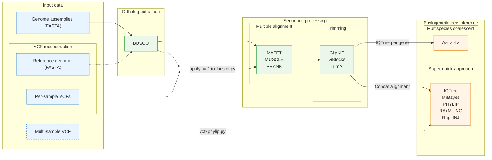

  <h1 align="center">BuscoClade</h1>

  <i>Snakemake-based workflow to construct species phylogenies using BUSCOs</i>

	
	
	

---

## Workflow

- **Ortholog extraction:** [BUSCO](https://busco.ezlab.org/)
- **VCF-based SNP application:** [apply_vcf_to_busco.py](Advanced-Usage#vcf-based-snp-application), [vcf2phylip](https://github.com/edgardomortiz/vcf2phylip)
- **Alignment:** [MAFFT](https://mafft.cbrc.jp/alignment/software/), [MUSCLE](https://doi.org/10.1038/s41467-022-34630-w), [PRANK](http://wasabiapp.org/software/prank/)
- **Trimming:** [ClipKIT](https://github.com/JLSteenwyk/ClipKIT), [TrimAl](http://trimal.cgenomics.org/), [GBlocks](https://academic.oup.com/mbe/article/17/4/540/1127654)
- **Phylogenetic tree construction:** [IQTree](http://www.iqtree.org/), [MrBayes](https://nbisweden.github.io/MrBayes/), [ASTRAL-IV](https://doi.org/10.1093/molbev/msaf172), [RapidNJ](https://birc.au.dk/software/rapidnj), [PHYLIP](https://phylipweb.github.io/phylip/), [RAxML-NG](https://github.com/amkozlov/raxml-ng)
- **Visualization:** [Etetoolkit](http://etetoolkit.org/), [Matplotlib](https://matplotlib.org/stable/)

---

## Wiki contents

- [[Usage]] — input preparation, configuration, running the pipeline
- [[Configuration]] — all config parameters with defaults and descriptions
- [[Apptainer]] — running BuscoClade via pre-built Apptainer container
- [[Advanced-Usage]] — starting from existing BUSCO results, gap-aware AltRef insertion
